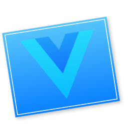
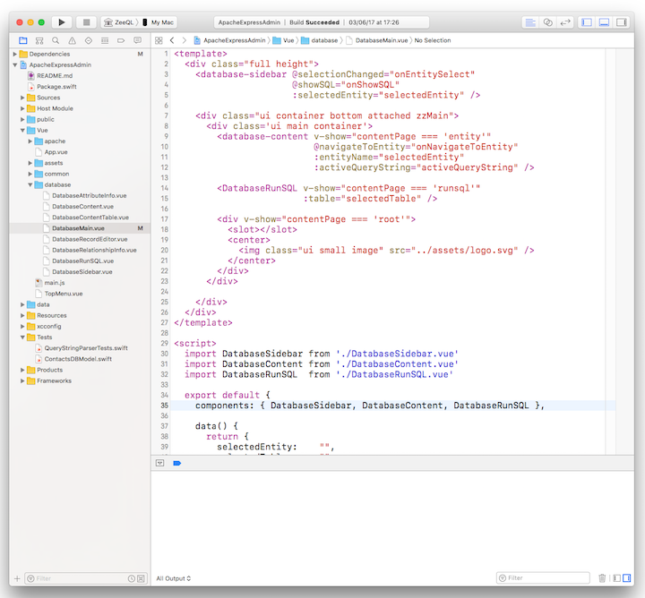

<h2>VueXcode

</h2>

Want to edit Vue components in Xcode, but they just show up in black&white?
Trying to change the file type using the 'Type' popup, 
but Xcode can't remember?
Enter VueXcode.

This impressive macOS application features a stunning info panel
(it also registers a custom UTI for .vue files).
Grab the application, run it once, and in the future your Vue components
show up in pretty colors:

Credits go to
[Matt Stevens](https://stackoverflow.com/users/22368/matt-stevens)
for explaining how to do it on
[StackOverflow](https://stackoverflow.com/questions/9050035/how-to-make-xcode-recognize-a-custom-file-extension-as-objective-c-for-syntax-hi).

### Who

**mod_swift** is brought to you by
[The Always Right Institute](http://www.alwaysrightinstitute.com)
and
[ZeeZide](http://zeezide.de).
We like feedback, GitHub stars, cool contract work,
presumably any form of praise you can think of.
We don't like people who are wrong.
